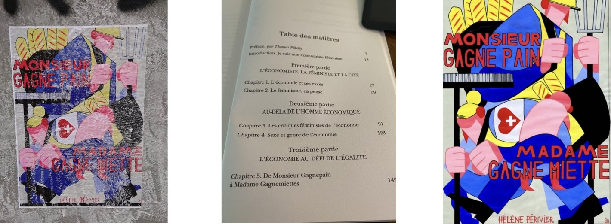

I am a Director of Research at the [OFCE](https://www.ofce.sciences-po.fr/en/), [Sciences Po](https://www.sciencespo.fr/en/).

My research focuses on evaluation of family, social and tax policies, and on the analysis of gender inequalities in the labour market, in the family and in higher education. I am also interested in the history of economic thought with a feminist perspective.

I am the director and the co-founder of the gender studies program of Sciences Po, [PRESAGE](https://www.sciencespo.fr/programme-presage/fr.html). Since April 2023, I am the president of the *High Family Council* in the [*Haut Conseil de la famille de l'enfance et de l'âge, HCFEA*](https://www.hcfea.fr/). This Council aims at fostering and leading public debate on family issues and public policies in the French context.

### Just released

-   ["De Sciences Po à l'Éna, la voie étroite vers les sommets de la fonction publique: L'effet croisé du genre et de l'origine sociale"](egale1.pdf), joint with Maxime Parodi and Fabrice Larat, *Revue d'Économie Politique*, volume 135, n°6, 2025.

-   ["Mesurer les violences sexistes et sexuelles en milieu étudiant. Défis méthodologiques et incertitudes juridiques"](pdf/defi.pdf), joint with Victor Coutolleau and Clara Le Gallic-Ach, *Bulletin of Sociological Methodology/Bulletin de Méthodologie Sociologique*, Volume 168, Issue 1, Octobre 2025. [doi : 10.1177/07591063251370960](https://doi.org/10.1177/07591063251370960)

-   ["À l'aveugle. L’effet genré du « paravent » dans le recrutement des instrumentistes d’orchestre"](pdf/tgs.pdf), *Travail, genre et sociétés*, n°53, April 2025, joint with Hyacinthe Ravet, Reguina Hatzipetrou-Andronikou, Audrey Etienne et Maxime Parodi. doi : 10.3917/tgs.053.0097 

-   ["Student Exposure to Gender-Based and Sexual Violence: SAFEDUC 2024 Survey Results"](https://www.sciencespo.fr/gender-studies/en/research/safeduc-research-project/2024-results/), SAFEDUC team.

-   ["Synthèse de la passation de l'enquête SAFEDUC. Représentativité d'une enquête sur les VSS en milieu étudiant"](pdf/WP_passationV2.pdf), joint with Victor Coutolleau and Clara Le Gallic-Ach, Working paper OFCE, n°9, 2025.

-   ["From choice to capabilities: abortion and reproductive justice"](pdf/FE.pdf), joint with Hazal Atay, *Feminist economics*, March 2025.

### In the media

-   France Culture, Entendez-vous l'éco -\> Homo oeconomicus (5/44): ["Du paternalisme à la privatisation, le choix de la crèche"](https://www.radiofrance.fr/franceculture/podcasts/entendez-vous-l-eco/entendez-vous-l-eco-emission-du-lundi-23-septembre-2024-1549139), (Septembre 2024).

-   France Inter, *Le téléphone sonne* -\> ["Quelles priorités pour les familles monoparentales?"](https://www.radiofrance.fr/franceinter/podcasts/le-18-20-le-telephone-sonne/le-18-20-le-telephone-sonne-du-vendredi-07-juin-2024-1339206), (June 7, 2024).

-   France Culture, *Entendez-vous l'éco? -\>* ["Un Nobel à soi: Claudia Goldin ou l'économie féministe"](https://www.radiofrance.fr/franceculture/podcasts/entendez-vous-l-eco/un-nobel-a-soi-claudia-goldin-ou-l-economie-feministe-4727328), (Octobre 2023).

    on the same topic in *The Conversation* -\> [« Nobel » d'économie : Claudia Goldin et l'émancipation des femmes américaines](#0)

-   Podcast Genre etc. [Faire de la recherche en féministe](https://smartlink.ausha.co/sciencespo-presage-genre-etc/focus-faire-de-la-recherche-en-feministe), discussion with Geneviève Fraisse, (Septembre 2023).

### My latest book

{fig-align="center" width="300"}

In the streets of Nantes (FR), this poster displays the *female crumbswinner model* (that echos to the *male breadwinner model*), concept that I develop in my research, in particular in the Chapter 5 of my book *L'économie féministe* -\> Thanks to the artist for disseminating ideas!

{fig-align="center" width="650"}
